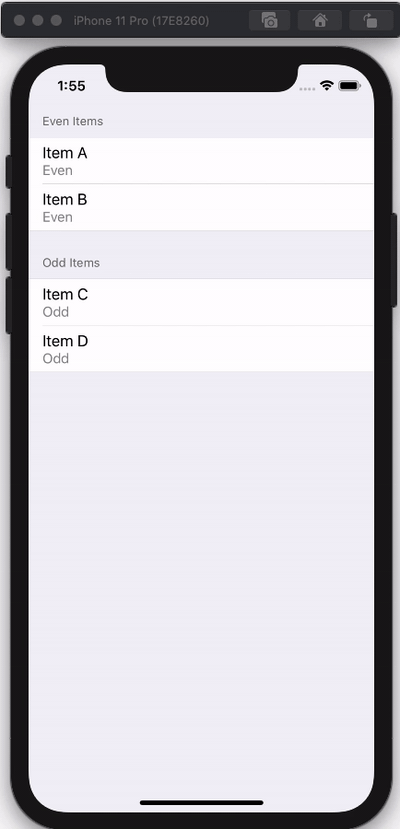

# SwiftUI List Section Bug

This is meant to be a relatively small, reproducible example of a bug I've encountered with my SwiftUI app. I don't know if this is a SwiftUI bug or if I'm doing something inherently wrong.

# Update: Workaround

A contact at Apple provided a workaround which fixes the bug for me:


```swift
ForEach(section.items) { item in
    ItemCell(item: item)
        .id(item.id) // This is the magic workaround
        // onTapGesture here 
    }
}
```

I've filed a Feedback with Apple FB7721284.

# Bug Description

I have 4 items with the corresponding types:
1. A: even
1. B: even
1. C: odd
1. D: odd

I have a `List` with a `Section` for even and odd items. When I tap on Item C and change its type to Even, it will get correctly re-sorted into the Even Items section, but the cell for the row will not be updated to reflect that; it incorrectly says "Odd". The underlying data has definitely changed but SwiftUI is not properly re-rendering the cell.

See this GIF for a demonstration:




## Architecture Setup

The underlying setup of the project is a lot more complicated than it might look from the example GIF. This is meant to mimic my real app. It was inspired by this [SwiftUI, Combine, and Firebase tutorial](https://peterfriese.dev/replicating-reminder-swiftui-firebase-part1/).

* It uses an `ItemRepository` which meant to be is the single source of truth for the via a `@Published` array of `ListItem` objects.
* The `List` gets the Sections/items to display from a  `@ObservedObject var viewModel = ViewModel()`
* The `ViewModel` uses Combine to subscribe to changes in the `ItemRepository` array, and dynamically sorts the `ListItem`s into `ListSection`s whenever the repository changes.
* The `ItemDetailView` sheet has its own instance of a `ListItem` and uses Combine to subscribe to the user's changes. When the user changes the type of item, it tells the `ItemRepository` to update the source of truth, which causes the items to be re-sorted into Sections.

### Bug Details
* When the sheet is closed, you can see that Item C has been re-sorted into the Even Items section, as desired. However, its `ItemCell` has not re-rendered, and it's still listed as "Odd". This is the bug I'm trying to solve.
* Debugging in more detail, when I change the type I see that that the `ItemCell` initializer is only called for the 3 _other_ objects (A,B,D). It is never called for Item C. It seems that SwiftUI is reusing the old view for some reason I don't understand. 

# Attempted Mitigations

I've been fighting this for a while so there are quite a few things I tried.

## 1. Switching Tabs

This is only a temporary bug. Switching to a different tab and coming back will cause the List to re-render properly. If there were enough items in the List, even scrolling down and back will cause the item to re-render.

If I was in the UIKit world, I would just force the underlying `UITableView` to `reloadData()`. (I have tried doing this via [SwiftUI-Introspect](https://github.com/siteline/SwiftUI-Introspect) but it didn't work. 😢)

## 2. Recreate the `Section`s every time

One unacceptable workaround I've found is to change this line:

```swift
ForEach(self.viewModel.sections, id: \.name) { section in
```

to:

```swift 
ForEach(self.viewModel.sections) { section in
```

To elaborate: My `SectionList` objects are `Identifiable` and can create their own `id` via: `var id: UUID()`. So when I omit the `id: \.name` keypath, they create new sections with a new ID every time. This avoids the bug, but is undesirable.

My understanding is that the sections *should* be the same between re-renders. Creating new sections all the time leads to other bugs in my app like swipe-to-delete having glitchy animations, jumping to the top of the list when I modify list items, flickering, etc. 

Similarly, if an item gets moved to a brand new section, it gets rendered properly. For example, if I set all the items to be Even and there isn't an Odd section, and then I change one of them to be Odd, it will properly render the list. In the code for this example, I'm creating both sections every time so that doesn't show up, but it would be easy to do.

## 3. Trying to force a re-render for the specific cell

I tried to add a new `Bool` property to the `ListItem` struct, and force the `ItemCell` View to depend on that variable. I explicitly updated the boolean just for that single item in the `ItemDetailView` sheet. However, it didn't work. The `ItemCell` initializer still didn't get called when Item C was changed.

There may be some other way to force it to render, and if you have any ideas, I'd love to hear them.

## 4. Using a `NavigationLink` instead of a sheet

I tried using a `NavigationLink` to go into the details of an item. However, when I make edits on that item, SwiftUI automatically pops me back to the root `ListView` because the underlying list has changed. (I find this frustrating as well, but seems to be the nature of how SwiftUI works.)

# Ideas or Suggestions?

Potentially this overall architecure of subscribing to changes in an underlying repository may be problematic. I'm open to other architectures.

Fundamentally, I still have the business requirement that when a user selects an item from a List, I need to make changes to the underlying List. This seems tricky in Swift UI. 

At this point, I'd even be happy with a hacky workaround. If anyone has an idea, please reach out at github AT jeremygale DOT com. Thank you!